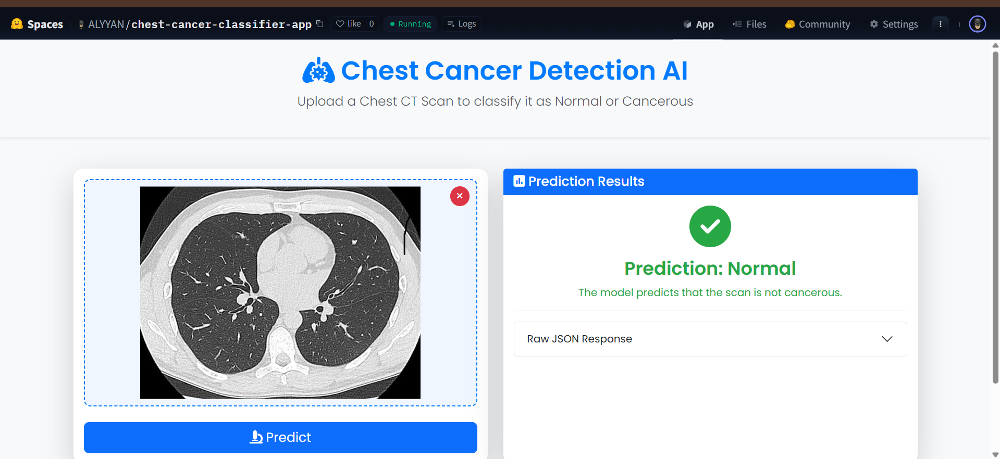

<div align="center">

# 🩺 End-to-End Chest Cancer Classification

**An MLOps project demonstrating the complete lifecycle of a deep learning model, from data ingestion to CI/CD-powered deployment.**

[](https://github.com/AlyyanAhmed21/End-to-End-Chest-Cancer-Classification-using-MLflow-and-DVC/actions/workflows/main.yaml)
[](https://opensource.org/licenses/MIT)
[](https://www.python.org/downloads/release/python-380/)

</div>

---

## 🚀 Live Demo

Experience the deployed application live on Hugging Face Spaces!

**[➡️ Live Demo Link](https://huggingface.co/spaces/alyyanahmed21/chest-cancer-classifier-app)**

*(Note: The Space may be asleep if it hasn't been used recently. Please allow a moment for it to wake up.)*

## 🖼️ Application Screenshot

Here is the user interface of the deployed Flask web application.



## 📖 About The Project

This project implements a complete end-to-end MLOps pipeline for a Chest Cancer image classification task. A deep learning model (based on VGG16/ResNet) is trained to distinguish between Normal and Adenocarcinoma chest CT scans.

The primary focus is not just on the model's accuracy, but on building a robust, reproducible, and automated system using modern MLOps tools.

### Key Features:

-   **Experiment Tracking:** Uses **MLflow** to log parameters, metrics, and model artifacts for every run.
-   **Data & Model Versioning:** Uses **DVC** to version large data files and models, keeping the Git repository lightweight.
-   **Automated CI/CD:** A **GitHub Actions** workflow automatically tests, builds, and deploys the application on every push to the `main` branch.
-   **Web Application:** A user-friendly **Flask** application serves the trained model for real-time predictions.
-   **Containerization:** The entire application is containerized with **Docker** for consistent and portable deployment.
-   **Cloud Deployment:** Deployed for free on **Hugging Face Spaces**.

## 🛠️ Tech Stack

-   **Backend:** Python, Flask
-   **Model:** TensorFlow, Keras
-   **MLOps Tools:** MLflow, DVC, Dagshub (for remote tracking)
-   **CI/CD & Deployment:** Docker, GitHub Actions, Hugging Face Spaces

## 🌊 MLOps Workflow

The project follows a structured MLOps workflow, which is fully automated by the CI/CD pipeline.

```mermaid
graph TD
    A[Start: Push Code to GitHub] --> B{GitHub Actions CI/CD};
    B --> C[CI: Install Dependencies & Run Tests];
    C -->|Success| D[CD: Deploy to Hugging Face];
    D --> E[🚀 Live Application];

    subgraph "DVC & MLflow Cycle (Local/Remote)"
        F[1. `dvc repro`] --> G[2. Pull Data (DVC)];
        G --> H[3. Train Model];
        H --> I[4. Log Metrics & Model (MLflow)];
        I --> J[5. Push Model (DVC)];
    end
```

## ⚙️ Getting Started - Local Setup

To run this project on your local machine, follow these steps.

### Prerequisites

-   Git
-   Python 3.8+
-   A DagsHub account (for MLflow tracking)

### Installation & Setup

1.  **Clone the repository:**
    ```bash
    git clone https://github.com/AlyyanAhmed21/End-to-End-Chest-Cancer-Classification-using-MLflow-and-DVC.git
    cd End-to-End-Chest-Cancer-Classification-using-MLflow-and-DVC
    ```

2.  **Create a virtual environment:**
    ```bash
    python -m venv venv
    source venv/bin/activate  # On Windows: venv\Scripts\activate
    ```

3.  **Install dependencies:**
    ```bash
    pip install -r requirements.txt
    ```

4.  **Set up MLflow/DagsHub credentials:**
    Create a `.env` file in the root directory and add your credentials. This file is ignored by Git.
    ```env
    MLFLOW_TRACKING_URI="https://dagshub.com/YourUsername/YourRepoName.mlflow"
    MLFLOW_TRACKING_USERNAME="YourUsername"
    MLFLOW_TRACKING_PASSWORD="YourDagsHubAccessToken"
    ```

5.  **Run the DVC pipeline:**
    This command will execute all stages defined in `dvc.yaml` (data ingestion, model preparation, training, and evaluation).
    ```bash
    dvc repro
    ```

6.  **Run the Flask application:**
    ```bash
    python app.py
    ```
    Open your browser and navigate to `http://localhost:8080` to use the app.

## 📁 Project Structure

```
.
├── .dvc/                # DVC metadata
├── .github/workflows/   # GitHub Actions CI/CD pipeline
├── artifacts/           # (Generated by DVC) Data, models, etc.
├── config/              # Configuration files (config.yaml)
├── src/                 # Source code for the project
│   └── cnnClassifier/
│       ├── components/    # Individual pipeline components
│       ├── config/        # Configuration management code
│       ├── entity/        # Custom entity definitions
│       ├── pipeline/      # DVC pipeline stage definitions
│       └── utils/         # Utility functions
├── templates/           # HTML templates for the Flask app
├── .gitignore
├── app.py               # Main Flask application entrypoint
├── dvc.yaml             # DVC pipeline definition
├── Dockerfile           # Docker configuration for deployment
├── main.py              # Main project orchestrator
├── params.yaml          # Model parameters
└── requirements.txt     # Python dependencies
```

## 📜 License

This project is licensed under the MIT License - see the [LICENSE](LICENSE) file for details.

---
<div align="center">

**Star the repo if you found it useful! ⭐**

</div>